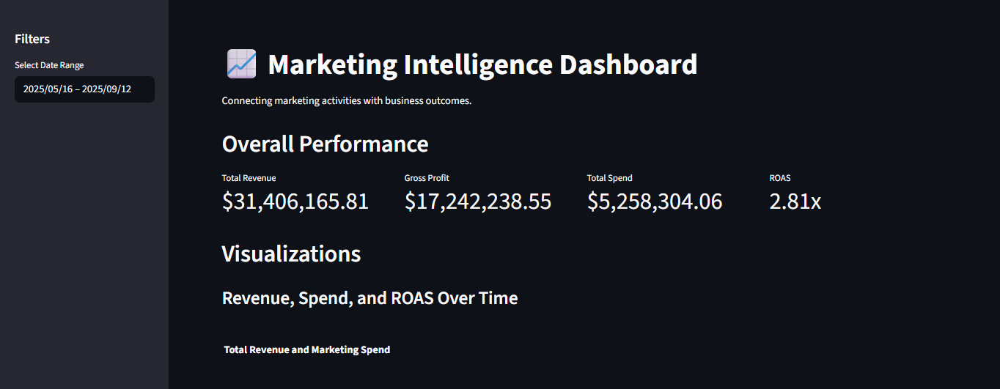
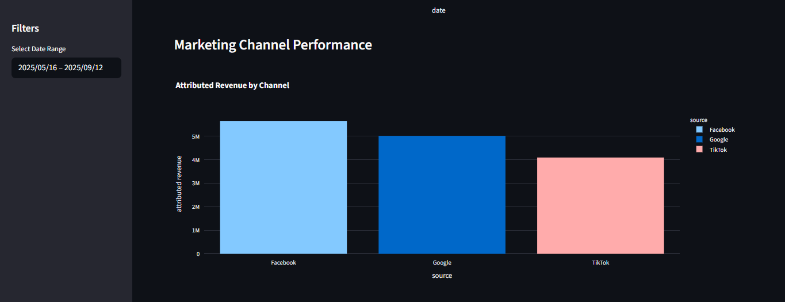
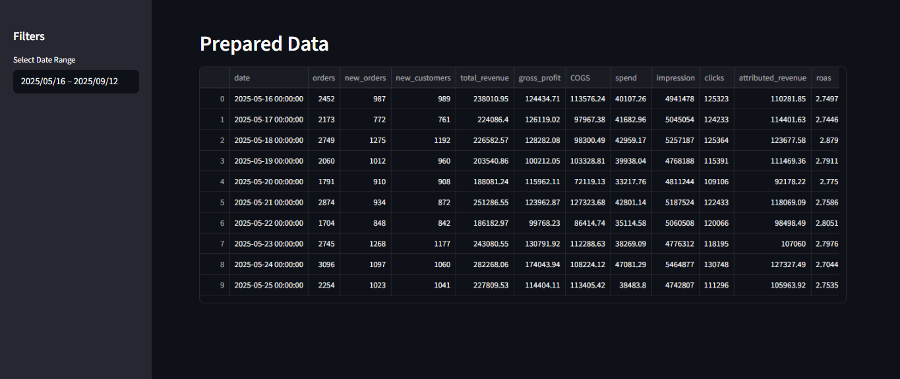
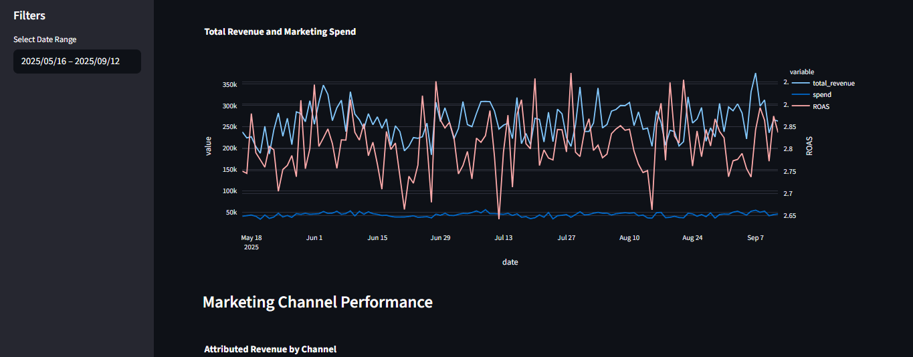

# Marketing Intelligence Dashboard

This project is an **interactive Business Intelligence (BI) dashboard** built to analyze and visualize the connection between marketing activities and business outcomes for an e-commerce brand.

The dashboard provides a consolidated view of key performance indicators (KPIs) from various marketing channels and connects them to core business metrics like revenue, orders, and customer acquisition.

---

## 📊 Key Features

- **Unified View:** Combines campaign-level data from Facebook, Google, and TikTok with daily business performance data.
- **Interactive Filtering:** Dynamically filter by a specific date range to analyze performance over time.
- **Core KPI Metrics:** At-a-glance view of Total Revenue, Gross Profit, Total Marketing Spend, and overall Return on Ad Spend (ROAS).
- **Trend Analysis:** Visualize revenue, spend, and ROAS over time to identify trends and the impact of marketing campaigns.
- **Channel Performance Breakdown:** Compare effectiveness of different marketing channels (Facebook, Google, TikTok) based on attributed revenue, spend, and ROAS.

---

## 🖼️ Dashboard Screenshots

### Full Dashboard


### Revenue Trend Over Time


### Channel Performance Breakdown


### ROAS Analysis


---

## 🛠️ Tech Stack

- **Language:** Python  
- **Web Framework:** Streamlit  
- **Data Manipulation:** Pandas  
- **Data Visualization:** Plotly  

---

## 🚀 Getting Started

### Prerequisites
- Python 3.8 or higher  
- pip (Python package installer)

### Installation
1. Clone the repository:

```bash
git clone https://github.com/Rohitmahi2003/Assessment1_MID_REPORT.git
Navigate to the project directory:
```
```bash

cd MID_report
```
Install the required libraries:

```bash
pip install -r requirements.txt
```
Running the Application
Once dependencies are installed, run the Streamlit dashboard:

```bash
streamlit run app.py
```
Your browser will open the dashboard at http://localhost:8501.

📂 Project Structure

```bash
MID_report/
├── app.py                  # Main Streamlit dashboard script
├── business.csv            # Daily business performance data
├── Facebook.csv            # Facebook campaign data
├── Google.csv              # Google campaign data
├── TikTok.csv              # TikTok campaign data
├── requirements.txt        # List of Python dependencies
├── README.md               # Project documentation
└── images/                 # Screenshots of dashboard

    ├── output1.png
    ├── output2.png
    ├── output3.png
    └── output4.png
```
💡 Notes
Keep the env/ folder local. It is excluded from GitHub via .gitignore.

Use requirements.txt to recreate the Python environment.

The dashboard is fully interactive—you can filter by date and explore trends.
